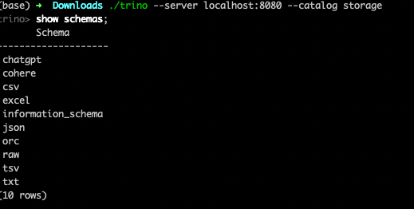

# Trino Lucario


## Who is that Pokemon ?
  ### Its Lucario ....

Trino Lucario is intelligent fighter type Pokemon with high volatile nature (experimental purpose), 
integrating Trino SPI plugin and LLM APIs like ChatGPT and Cohere Generative APIs

This is Fork of Trino-Storage Package present here: https://github.com/snowlift/trino-storage/tree/master. 
this plugin makes reading different file formats from different places easier for trino users.

Currently ,
```
Trino Lucario = Trino-Storage + Few RestAPI classes + utilities
```

### Capabilities in NutShell

- This Plugin is a super simple plugin that connects with OpenAI chatGPT and Cohere APIs currently and is expected to connect with other GPT providers soon.

- Using this OpenAI Language model (specifically chatGPT), this plugin provides the following capabilities to trino engine.
  - We can generate the data in real-time based on the huge LLM knowledge base
  - For quick analysis, we can use the right prompt to get the data which is provided as Trino Table, this trino table can connect with other tables to enhance the analysis purposes and quickly come to an approximate solution.

> **_NOTE:_**  TLDR, this plugin can act as a Data Augmentation tool that generates data based on the user prompt  (natural language instead of SQL query), this opens up the possibility  of using this plugin for exploratory purposes.

- This plugin can help us with text classification also. you can provide the text column from any table read by different Trino Connectors and classify those text columns into different text classes (classification buckets).
   example: Sentiment Analysis.
- Multi-label Classification (predicting zero or more class labels)

- The Above two Data Augmentation and Classification are adaptable to different use cases using different prompt engineering techniques. These prompts can be given in  the connector.properties file.  This is not tested extensively yet, will try to test and raise a PR in the upcoming days.


## Trino-Lucario in Action:

It's easy to adopt trino-storage plugin by adding two classes and some tweaking, you will get the
chatgpt and cohere as schema, this is actually very clever interface provided by trino-storage
that exposes `schema` and when you use schema.path (csv./user/experiments/example.csv) 
it is considered as `table`.



### Data Augmentation :

- lucario use Double team

   
  
    - Lucario can generate fake data, which can be used to quickly derive some high level analytics. 
      
    - Data Generation is simple step here, it will take the prompt and generate CSV output (we will move this to json output later) 
    - This CSV string output is shown as table output. this table can be joined with our data to quickly generate some insights
    - Keep in mind that, output CSV string produced by the GPT model cannot be trusted 100%, expect some error, it hallucinates so completely use this for experimental purposes. 
      - for example:  if you have this table you can produce this analytics or chart as output

```
trino> select * from chatgpt."give me top 10 list of states in india based on population";

state      | population
----------------+------------
Uttar Pradesh  | 199812341
Maharashtra    | 112374333
Bihar          | 103804637
West Bengal    | 91347736
Madhya Pradesh | 72626809
Tamil Nadu     | 72147030
Rajasthan      | 68621012
Karnataka      | 61095297
Gujarat        | 60383628
Odisha         | 41974218
(10 rows)

Query 20230717_212135_00000_5whcr, FINISHED, 1 node
Splits: 1 total, 1 done (100.00%)
3.09 [10 rows, 178B] [3 rows/s, 58B/s]
```

### Data Entity extraction (aka) Strcutured Data extraction:

lucario use Bone Rush :


In this attack, lucario reads the text input and extracts the required entities from the text. 

for example: Let's say we have following CSV file:

```
text
"1. XYZ Corp: Founded in 2005, XYZ Corp's stock price has steadily risen by 25% in the past year, reflecting its strong financial performance and successful expansion into new markets."
"2. ABC Industries: With a starting date in 1990, ABC Industries has consistently delivered impressive financial results, as evidenced by its stock price increase of 40% in the last quarter."
"3. PQR Tech: Since its inception in 2012, PQR Tech has experienced substantial growth, resulting in a remarkable 150% surge in its stock price over the past year, indicating its robust financial health and market dominance."
"4. LMN Services: Despite being a relatively young company, founded in 2018, LMN Services has quickly made its mark, demonstrated by a stock price rise of 60% in the last six months, indicating its promising financial prospects."
"5. MNO Enterprises: Established in 1995, MNO Enterprises has consistently displayed financial stability, maintaining a steady stock price over the years, showcasing its solid market position and long-term profitability."%

```
we can ask lucario to extract details for us, currently it gives extracted output as json string, we can return this json 
string as separate table, we can use [Trino Polymorphic function](https://trino.io/blog/2022/07/22/polymorphic-table-functions.html) here. 

```shell
trino> SELECT ask_chatgpt('Strictly use information available only from the given text, Extract company name,started date, stock price, and their financial state as json',"text") as structured_output FROM
    -> storage.tsv."/tmp/example_unstructured.csv";
                         structured_output
-------------------------------------------------------------------
 {                                                                +
     "CompanyName": "XYZ Corp",                                   +
     "StartedDate": 2005,                                         +
     "StockPrice": 25,                                            +
     "FinancialState": "Strong"                                   +
 }
 {                                                                +
     "Company Name": "ABC Industries",                            +
     "Started Date": "1990",                                      +
     "Stock Price": "40%",                                        +
     "Financial State": "Impressive"                              +
 }
 {                                                                +
 "Company Name": "PQR Tech",                                      +
 "Started Date": "2012",                                          +
 "Stock Price": "150% surge",                                     +
 "Financial State": "robust financial health and market dominance"+
 }
 {                                                                +
   "Company Name" : "LMN Services",                               +
   "Started Date" : "2018",                                       +
   "Stock Price" : "60%",                                         +
   "Financial State" : "Promising"                                +
 }
 {                                                                +
     "company_name": "MNO Enterprises",                           +
     "establishment_date": 1995,                                  +
     "stock_price": "steady",                                     +
     "financial_state": "stable"                                  +
 }
(5 rows)

Query 20230717_215654_00001_5whcr, FINISHED, 1 node
Splits: 1 total, 1 done (100.00%)
14.89 [5 rows, 1.03KB] [0 rows/s, 71B/s]

```
 we can improve the output quality by providing some more instruction along with example in the prompt.

### Text Classification

lucario use `Detect`:


We can use this feature for simple to medium text classification tasks:

```
trino> SELECT "text",ask_chatgpt('classify the  sentiment of the given text as "postive" or "negative" with probability score',"text") as sentiment FROM
    -> storage.csv."/tmp/example_sentiment.csv"
    -> ;
                                      text                                       |             sentiment
---------------------------------------------------------------------------------+-----------------------------------
 pineApple product was doing very well now adays                                 | Positive (Probability Score: 0.8)
 New TV released from the brand ABX is not of good quality very much disappoined | Negative - 0.9
(2 rows)

Query 20230717_221444_00006_5whcr, FINISHED, 1 node
Splits: 1 total, 1 done (100.00%)
2.21 [2 rows, 126B] [0 rows/s, 57B/s]

trino> SELECT "text",ask_chatgpt('classify the  sentiment of the given text as "postive" or "negative" with score',"text") as sentiment FROM
    -> storage.csv."/tmp/example_sentiment.csv"
    -> ;
                                      text                                       | sentiment
---------------------------------------------------------------------------------+-----------
 pineApple product was doing very well now adays                                 | Positive
 New TV released from the brand ABX is not of good quality very much disappoined | Negative
(2 rows)

Query 20230717_221502_00007_5whcr, FINISHED, 1 node
Splits: 1 total, 1 done (100.00%)
2.27 [2 rows, 126B] [0 rows/s, 56B/s]
```

> **_Disclaimer:_** 
>   - We can use ask_chatgpt or ask_cohere functions, with my few testing scenarios chatgpt done a great job with very little prompting
>   - Please be aware that this chatGPT or Cohere APIs bill us every tokens, so it advisable to limit ourselves to small datasets.
>   - We can try to integerate Trino-SPI plugin with java based Deep learning library which will solve few ML usecases without any extra cost.

### Future Roadmap: 
- if this project seems to be really useful, we can improve this project in many ways, documenting few things below.

#### Pokemon Evolution Strategy:

- Cleanup or Standardize the new plugin classes

- Currently, prompts are hardcoded inside the Java code, I tried moving the prompts to the config properties file. but I am facing some issues. so I hardcoded the prompts and read the ChatGPT and Cohere API Keys from the Environmental Variables. Make the prompts configurable in connector.properties.

- Try to include Open source implementation in the plugin, for example HuggingFace Transformers, so that users can cost-effectively run Text Classification, and sentiment analysis using simple BERT models. and if they are using large-scale trino clusters they can use Large language models like Falcon for text generation for state-of-the-art performance.

- We have a famous langchain implementation in Java language also, we can make use of this framework to standardize our prompt usage in the plugin. if needed we can extend this plugin with the new capabilities of langchain like Chains and Agents.

  - Github Link: https://github.com/HamaWhiteGG/langchain-java

- We can also try to  leverage recently released openai functions which help in extracting structured output from the text documents.

- We can also leverage a Trino polymorphic function instead of using a normal Trino function for extracting the entities from the texts etc.

  - The polymorphic function returns a table itself, while the normal function returns a scalar

- WE leverage Trino’s Fantastic Collection of connectors and Talk to the Data using LLM. Thought having an LLM SQL agent as a Trino plugin, seemed a little bit of an anti-pattern, but we can this SQL agent sit in Trino/presto Gateway make use of all the Trino schema, and send the SQL to the underlying Trino cluster. that way all the organization data was powered by LLMs by just using the schema metadata. will try to cover this setup in the upcoming blog separately. 


